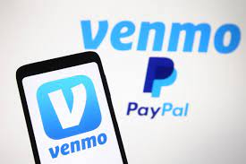
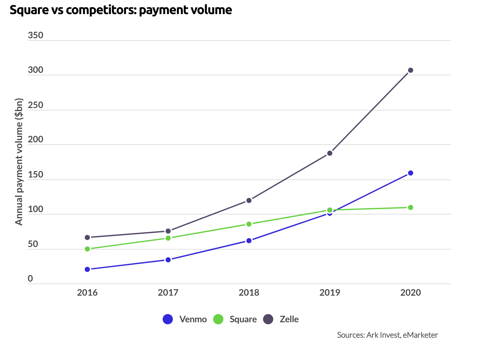

# Venmo Case Study 
Contirbutors: Tyler Gehbauer

## **Overview and Origin** 
-----

Venmo is a streamlined payment service that offers easy peer to peer payments. This service allows for 2 people to exchange paperless money between themselves using their phones (or internet). Originally, Venmo was designed to be a message-based payment platform. It later evolved to include a social aspect where you can see your contact’s payments. This aspect is what gave Venmo popularity and made it mainstream. 

## *The Founders and the Origin:*

>Venmo was founded in 2009 by Andrew Kortina and Irqam Magdon-Ismail. According to medium.com, “The idea came to them when Magdon-Ismail went to New York City to visit Kortina for the weekend and forgot his wallet. Kortina being the good friend that he is, covered Magdon-Ismail’s expenses for the weekend. When Magdon-Ismail was trying to pay back Kortina by mailing a check, they realized there must be a more streamline way to pay a friend.

---
## *How Venmo was funded:*

>In 2010, according to productmint.com, the Venmo team was able to receive funding from RRE Ventures, Betaworks, Lerer Ventures, Founder Collective, and more. They managed to raise $1.2 million to invest allowing the founders to pursue Venmo full-time. In 2012 the company went public and Braintree acquired Venmo for $26.2 million, and a year later in 2013, PayPal purchased Venmo for $800 million. The company is currently owned by PayPal and unfortunately the founders are no longer working at Venmo. This was a great move for PayPal. According to businessofapps.com, Venmo makes over $100 million in revenue every year and is continuing to increase due to more transactions occurring online. 

## *How Venmo Makes Revenue:*
>How does Venmo earn revenue? They charge small fees for instant transfers, debit/credit transfers, crypto transactions, and transactions with Venmo’s merchants. With the enormous user base of Venmo (currently at around 52 million users), this generates Venmo a massive amount of income making it one of the biggest payment apps in the United States. In 2020, Venmo made $450 million of revenue which happens to be around 16% of revenue generated for PayPal (via buisnessofapps.com). 

---
## **Business Activities**
---
## *What Financial Problems are Venmo Trying to Solve?:*
>As previously discussed, Venmo a big earner for PayPal, so financially the company is doing very well. However, there are some problems Venmo is facing that could result in more or less revenue. Some Venmo users have experienced hacking, but Venmo has always reimbursed the victim. This isn’t too frequent of an occurrence, but Venmo, and probably most Fintech companies, are continuously working on their security to prevent these types of occurrences from happening. 

>Furthermore, according to Investopedia.com, Venmo can only be used in the United States. If the company can figure out a way to make this service available in more countries, they would generate an insane amount of revenue. 
---
## *Venmo's Intended Customer, Market Size, and Solution:*

>Venmo is intended for everyone. However, Venmo is primarily utilized by people who are 34 or younger. In 2020, Venmo had 52 million users, “50 percent of users are between the ages 25 to 34, 33 percent are between ages 18 to 24”, according to businessofapps.com. This is probably because younger people most likely make smaller transfers compared to people who are older and have more money. Transfers with larger amounts of money involved ($10,000+) are usually done through their biggest competitor, Zelle. 

>What Venmo offers that their competitors don’t is the social platform, which resonates more with the younger generation. For example, Cash App is another big competitor to Venmo, with many similarities, but they don’t have the social feed that Venmo has. In today’s era, more people are using social media and like having the idea that they are connected to other people. The social feed shows users that it’s an active platform and shows how many of your contacts are also using the app. This feature alone is what made Venmo so popular, and could be what made the peer to peer payment services in general so popular. 

>Venmo has recently allowed users to transfer cryptocurrency and they also started delving into to the e-wallet competition. This shows that Venmo is staying relevant and are implementing new innovations. Venmo is taking aspects from all of their competitors and putting it into Venmo, which is already mainstream for the younger generation. Additionally, Venmo’s user interface being extremely easy to comprehend compared to other competitors, makes Venmo a powerhouse in this Fintech domain. In the future even more people will start using Venmo with all the features they will continue to add and improve on.
---
## *Technologies Venmo Utilizes:*
Some of the biggest technologies Venmo are utilizing are encryption, AHC processing, and payment gateways. 

>AHC stands for automated clearing house. According to Study.com, “Automated Clearing House is an electronic network used to transfer money between financial institutions.”
Venmo uses AHC processing to transfer a user’s money to and from their bank. Venmo works with Plaid (a financial services company) for their AHC processing.

>The Venmo website states that they use encryption to help protect account information and monitor account activities to help detect unauthorized transactions. This technology is used for the security of the users. 

>Lastly, when paying a merchant that accepts Venmo, the technology used is payment gateways. According to vilmate.com, “a gateway is a mediator that authorizes the transaction, helps encrypt data and fill out the order”. Basically, this technology acts as a payment processor. 
---
## **Landscape**
---
## *The Fintech Domain and Trends/Innovations:*
>Venmo falls under the Payments and Remittance Fintech Domain. Much has changed in the mobile payment industry since Venmo came out. In the past 5-10 years, mobile peer to peer payments have been normalized to the point where not many people even carry around physical cash anymore. Venmo made peer to peer online payments mainstream due their app’s social aspect. Since then, more can be done on Venmo and other similar apps. For instance, according to productmint.com, “in 2015, Venmo launched its Pay with Venmo feature, which allowed users to pay with Venmo at any merchant that is a PayPal partner.”  When using Venmo, a digital bank is created for the user to hold their funds until they want to transfer the funds back to their bank account. This allows users to use the funds from their Venmo balance to purchase goods from select merchants. In 2018, Venmo allowed people to transfer the funds from their digital bank to a Venmo debit card backed by Visa. This would allow many different users to combine money and put it on a single debit card, which can be useful in a handful of scenarios. Recently in 2020, Venmo even announced that they are offering a Credit card service and consumers would benefit from a cash back program. Furthermore, in 2021 Venmo made it so users can buy, sell, and store popular cryptocurrencies. Making Venmo a potential competitor to Coinbase. 
---
## *Other Companies in this Domain:*
> Most of Venmo’s competitors in this domain have the same features to keep up with the competition. Some of Venmo’s biggest competitors (via Investopedia) are Apple/Android Pay, Google Pay, Facebook, Cash App, and Zelle. They all offer the same service of mobile peer to peer payments with slight differences on the fees, limits, and availability. Google Pay and Apple Pay, for example, are very similar to Cash App and Venmo, but they can be used outside of the United States. Furthermore, select merchants accept payments depending on which service is being used. For instance, you can use Apple Pay at McDonald’s, but not Venmo. 
One of the biggest competitors to Venmo is Zelle. Zelle is basically a money transfer application designed by and for U.S banks like Wells Fargo and Bank of America. The biggest difference between them is the amount of money transferred annually. According to Investopedia, an average Venmo payment is around $10, whereas Zelle has an average payment of over $1,000. Banks would prefer to use Zelle since Venmo has a weekly limit of $7,000 to be sent and received.
---
## **Results**
---
## *Business Impact:*
>Venmo has impacted this domain significantly. Venmo introduced and normalized mobile peer to peer payments. If it weren’t for Venmo, many of its competitors may not even exist or be popular. With Venmo making its user interface simple and easy to operate, along with its social aspect, it remains one of the most popular payment apps and is continuing to grow. With many younger individuals utilizing Venmo, it’ll continue to be used by future generations, which can impact the way markets and banks operate in the future. Who knows, maybe in the future no one will use cash, and the only way to transfer funds from one party to another will be through payment apps like Venmo.
---
## *Metrics and Performance:*
>Some of the core metrics Venmo uses to measure its success include, total payment volume per year, the number of users, and amount of revenue generated per year. According to businessofapps.com, in 2020, Venmo had a total payment volume of $159 billion. This is more than double their payment volume in 2018, which was $62 billion. Similarly, in 2020, there were around 52 million users, which is more than double the amount of users they had in 2018 (23 million). Lastly, Venmo made $450 million in revenue, and not surprising to find out that it’s more than double the amount of revenue they earned in 2018 ($200 million). With Venmo’s recent feature to buy and sell cryptocurrencies, these numbers will inevitably go up further. According to cnbc.com, “PayPal’s Venmo app, which began supporting cryptocurrency services in April, saw payment volume jump 36% to $60 billion.”
---
## *Performance relative to competition:*
>Two of Venmo’s biggest competitors are Cash App and Zelle. When it comes to the userbase, Zelle takes the prize for having the largest userbase out of these companies at around 86 million (via zellepay.com). Cash App on the other hand has the smallest userbase out of these companies at around 36 million according to businessofapps.com.
>Comparing these companies via revenue earned is pretty tricky. Cash App in 2020, for example, had a revenue of $5.9 billion! However, 76% of Cash App’s revenue came from Bitcoin. Venmo just recently added this feature so only time will tell who the leader of this category will be. Furthermore, according to finty.com, Zelle earns 1% when they facilitate payments with banks. Since Zelle has facilitated $307 billion in payments in 2020, this means they generated around $3 billion in revenue. With Cash App and Venmo having the ability to buy and sell cryptocurrencies, revenues generated for the respective companies will continue to sky rocket. 

>Lastly, this graph shows you how each company compares to each other’s total payment volume on a yearly basis (via businessofapps.com). Clearly, you can see how Zelle trumps both companies, however as previously discussed, Cash App and Venmo are usually used for smaller payments. However, it seems like Venmo is trending in the right direction and will likely conitue to do so.

In conclusion, I believe Venmo will continue to outperform Cash App, especially with their most recent feature that allows users to buy and sell cryptocurrencies. This many even result in Venmo becoming a serious competitor to Zelle. Maybe some of my recommendations to Venmo will make this outcome inevitable. 

---
## **Recommendations**
---
>Obviously, judging off of Cash App’s performance in 2020, Venmo should do more with cryptocurrency. Yes, they did recently add the feature to buy and sell cryptocurrency. However, I don’t think many people even realize that Venmo offers this feature. Additionally, they only allow you to buy and sell a select few cryptocurrencies; specifically, Bitcoin, Litecoin, and Ethereum. Venmo’s brand is being user friendly and having a social aspect that connects the users to each other. Thus, my recommendation would be to make this feature easy to comprehend and readily available for people who know nothing about cryptocurrency. Make it so that the feature to buy cryptocurrency is one of the tabs on the main page. Currently a user would have to go into their settings and set it up themselves. If Venmo made buying and selling cryptocurrency easy to do and easy to understand, it would result in a massive amount of success for Venmo. They can even do some sort of thing that Coinbase did, where they would inform users about cryptocurrency in an easy way via short videos. Speaking of Coinbase, another recommendation I have for Venmo is to allow more cryptocurrencies to be bought and sold on their platform. Doing this would make them a serious competitor to Coinbase, and would generate them even more money. 

>A few more recommendations I would make would be to allow users outside of the United States to use Venmo. Currently, it’s only available in the United States. Doing this would make Venmo more of a competitor to Apple Pay, Google Pay, and even the European/Asian exclusive peer to peer payment applications. Obviously, the more people using their product would result in more money for the company. Which brings me to my last recommendation. Venmo should try and partner with more merchants. Venmo would earn more money doing this since they earn revenue when users use the Pay with Venmo feature. If more merchants accepted Venmo, that’s more money Venmo earns and its less people using their competitors applications. 
---

>I’m pretty sure the technologies they would need to make my recommendations a reality is already available to them. My recommendations are improving on what they already have done, which means they would probably need more servers and stronger computers with more RAM to handle the number of new users. More users would also mean they would need to improve their encryption for users’ safety. As far as partnering with more merchants, that probably requires contracts and agreements to be made which is really out of anyone’s control. Lastly, I’m not too sure what’s limiting Venmo from expanding to other countries, but they can utilize their AHC processing to transfer a user’s funds to and from their respective banks. Maybe they could start with countries similar to the United States first if they want to expand, like the United Kingdom and Canada. 
---
All in All, in the recent years Venmo has become a force to be reckon with in the Payments Fintech domain. Based off recent data it seems they are continuously improving and keeping up to date with innovations in this domain. I really believe Venmo could become the ultimate payment service if they continue to innovate and take my recommendations into account. Especially if they were able to improve their cryptocurrency service, I can see them being even greater competitors to Zelle than they already were. We will have to wait and see what happens in the future of this Fintech domain, but the possibilities are endless and exciting. 

---

## SOURCES

General: 
> https://medium.com/@telgar/venmo-the-wallet-of-the-future-d45900b6811b

>https://productmint.com/the-venmo-business-model-how-does-venmo-make-money/

> https://www.cnbc.com/2021/11/08/paypal-pypl-earnings-q3-2021.html

>https://finty.com/us/business-models/zelle/#:~:text=In%202020%2C%20Zelle%20facilitated%20over,impressive%20revenues%20from%20its%20service.

>https://www.investopedia.com/articles/personal-finance/010715/venmo-its-business-model-and-competition.asp

Analytics:

>https://www.businessofapps.com/data/venmo-statistics/#Venmorevenue

>https://www.businessofapps.com/data/cash-app-statistics/

Tech stuff:
>https://study.com/academy/answer/what-technology-does-venmo-use-to-transfer-money-from-the-user-s-bank-account-to-their-corresponding-venmo-account-do-they-talk-to-banks-and-check-if-they-provide-apis-to-do-this-for-free.html

>https://help.venmo.com/hc/en-us/articles/360035844973-Security#:~:text=We%20use%20encryption%20to%20help,at%20support%40venmo.com.

>https://vilmate.com/blog/payment-gateway-integration-in-a-mobile-application/
